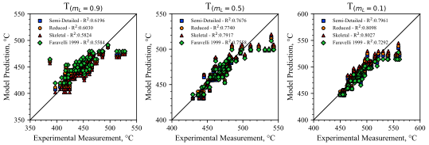
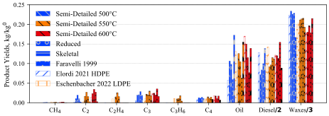

# PE kinetic Mechanisms

In this folder are present the CHEMKIN format files.
The mechanisms are labelled polymer_Nspecies_Nreactions. For instance HDPE_50_480 
is the mechanism with 50 species and 480 reactions.
The mechanism proposed for HDPE are:
- [HDPE_125_4000](HDPE_semidetailed) the updated published mechanism cantera and 
    opensmoke compatible 
- [HDPE_50_480](HDPE_reduced) a reduced version with lower computational cost.
- [HDPE_10_10](HDPE_multistep) a "global" model with significantly lower computational cost.

The same versions are available for LDPE as well: [semi-detailed](LDPE_semidetailed), [reduced](LDPE_reduced)
and [multistep](LDPE_multistep) are available. The number of species involved is the same. 
The reduction is performed with the approach proposed by [Pegurri et al. (2023)](https://doi.org/10.1016/j.combustflame.2023.113202).

*The [multi-step HDPE](HDPE_multistep) and [multi-step LDPE](LDPE_multistep) mechanisms come with the gas-phase module!*

To cite the updated condensed-phase mechanisms refer to the following publication:
- **Locaspi, Andrea et al.** "Reduced-order condensed-phase kinetic models for polyethylene, polypropylene and polystyrene thermochemical recycling", Chemical Engineering Journal 500 (2024): 156949 [DOI](https://doi.org/10.1016/j.cej.2024.156949)

To cite the gas-phase mechanism refer to the following publication:
- **Locaspi, Andrea et al.** "A Semi-Detailed Pyrolytic Gas-Phase Kinetic Model for the Volatiles of Polyethylene Thermal Degradation", Proceedings of the Combustion Institute (2025), under review

All mechanisms are described in detail in the PhD thesis:
- **Locaspi Andrea**, "A lumped condensed-phase kinetic model for plastic waste thermochemical recycling", Politecnico di Milano, 2024
  
## Mechanism description

For all mechanisms, the starting polymer at room temperature is described by the species
P-HDPE-P_S and P-HDPE-P which represent the crystalline and amorphous polymer respectively.
For LDPE, the starting species are labelled P-LDPE-P_S and P-LDPE-P.
If the simulation starts above the melting point (130C), the polymer is 
described only by P-HDPE-P/P-LDPE-P. Polymer species in OpenSMOKE++ are required to be 
defined in gas-phase as well but do not have physical meaning.

With respect to the published mechanism [(Locaspi et al. (2022)](https://doi.org/10.1016/j.wasman.2022.11.028), 
the improvements are:
- better agreement with ethylene formation
- a species representative of the crystalline polymer is introduced
- different choice of LMW species to improve agreement with wax formation yields.
- stable short chain species are formed directly in gas-phase, while for longer
   compounds able to evaporate evaporation reactions are introduced, see [Locaspi et al. (2023)](https://doi.org/10.1016/j.jaap.2023.105960)  
- thermochemistry evaluated with group contributions and Prausnitz phase-change
   data. The difference in enthalpy between gas and liquid species is the 
   evaporation enthalpy, above the critical temperature liquid species share
   the thermodynamic properties of gas-species. *Manuscript under review*
- transport properties are evaluated with a simplified approach based on critical
   properties, see [Holley et al. (2009)](http://dx.doi.org/10.1016/j.proci.2008.05.067).

In each folder are present the standard CHEMKIN files (gas kinetics, liquid kinetics, 
thermodynamics, transport) and a sub-folder of LiquidProperties.
The latter is required by OpenSMOKE but reports only *FAKE* liquid properties of
all the chemical species included in the mechanism. These are required for the 
1D microgravity model available in OpenSMOKE, but they have not yet been addressed 
for polymers outside of 0D systems.

## Model Performances
All mechanisms are validated with ~100 of data from the scientific literature.
Here are reported few validation comparisons in terms of parity plots of mass-loss profiles 
and gas-phase yields. At T>650°C secondary gas-phase reactions occur which will be 
addressed in further studies.
The detailed model of [Faravelli et al. (1999)](https://doi.org/10.1016/S0165-2370(99)00032-7) is also reported for comparison.

  
 

