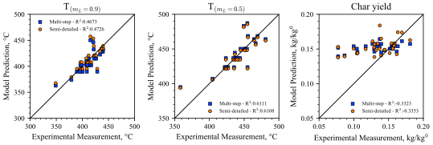
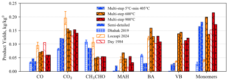

# PET kinetic Mechanisms

In this folder are present the CHEMKIN format files.
The mechanism is labelled polymer_Nspecies_Nreactions. For instance PET_85_700 
is the mechanism with 85 species and 700 reactions.
The mechanism proposed for PET are:
- [PET_85_700](PET_semidetailed) the published semi-detailed mechanism 
- [PET_18_19](PET_multistep) a "global" model with significantly lower computational cost.

The **thermodynamic properties have not been investigated due to lack of data** and
theoretical approaches for aromatic esters.

To cite the semi-detailed mechanism refer to the following publication:
- **Locaspi, Andrea et al.** "A lumped kinetic model and experimental investigation of Poly(Ethylene Terephthalate) condensed-phase pyrolysis", Chemical Engineering Journal 500 (2024): 156955. [DOI](https://doi.org/10.1016/j.cej.2024.156955)

To cite the multistep mechanism refer to: 
- **Locaspi, Andrea et al.** "A multi-step condensed-phase kinetic model for poly(ethylene terephthalate) thermal degradation", Proceedings of the Combustion institute, accepted
  
## Mechanism description

For all mechanisms, only the amorphous polymer is considered currently. 
The starting polymer is described in the semi-detailed mechanism by **"P-COPhCO-P"**
and **"P-OCCO-P"**, which represent the terephthalic and glycol moieties of the amorphous polymer
(present in equimolar ratios). For the multistep mechanism, both units are 
represented by the **"P-PET-P"** species. Both mechanisms consider a single condensed pseudo-phase
and model char as liquid-phase species. Mechanisms considering two condensed phases
can be provided upon request. Compared to the mechanisms for the other polymers, 
phase-change is considered separatedly and not pseudo-reaction is introduced.
In OpenSMOKE++, polymer and char species species must be defined in 
gas-phase as well, but do not have physical meaning.

In each folder are present the standard CHEMKIN files (gas kinetics, liquid kinetics, 
thermodynamics, transport) and a sub-folder of LiquidProperties.
The latter is required by OpenSMOKE but reports only *FAKE* liquid properties of
all the chemical species included in the mechanism. These are required for the 
1D microgravity model available in OpenSMOKE, but they have not yet been addressed 
for polymers outside of 0D systems.

## Model Performances
All mechanisms are validated with ~50 of data from the scientific literature.
Here are reported few validation comparisons in terms of parity plots of mass-loss profiles 
and gas-phase yields. In-depth discussion of the discrepancies between semi-detailed model and experimental data
are provided in the semi-detailed paper ([Locaspi (2024)](https://doi.org/10.1016/j.cej.2024.156955)),
while the deviations of the multistep model with respect to the semi-detailed one are discussed in the latter paper
(accepted).

MAH = Mono Aromatic Hydrocarbons, BA = Benzoic Acid, VB = Vinyl Benzoate,
TA = Terephthalic Acid, MVT = Monovinyl Terephthalate, DVT = Divinyl Terephthalate
 
 

