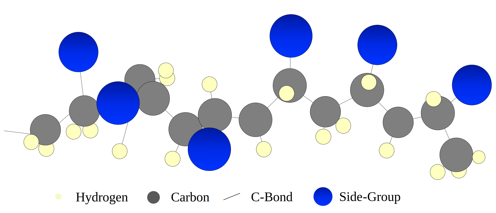

# Kinetic-Mechanisms

    

Kinetic Mechanisms for **gas**, **liquid** and **solid** fuels, current version CRECK_2003.
All the mechanisms are freely available in CHEMKIN format (compatible with version 3.6.2 and above) and 
are self-consistent, i.e. they contain smaller subsets and can be coupled together. 
Please contact us at creckmodeling-dcmc@polimi.it for questions and comments. 

## Choice of Kinetic Mechanisms
The kinetic mechanism are organized according to the reactive-phase:
- [**Homogeneous Gas-Phase**](Gas-Phase) mechanisms address compounds reacting in gas-phase (e.g., <ins>H2, gasolines, diesels</ins>). 
    
    **For a detailed list** of gas-phase kinetic mechanism &rarr; **[Click here](Gas-Phase/README.md#choice-of-kinetic-mechanism)**.
    
    <a href="mailto:creckmodeling-dcmc@polimi.it"> <ins>Mail us</ins> </a> for other mechanisms!
    

    
<i><b>Quick choice </b> of gas kinetic mechanism</i>

    &nbsp; HT = <i>High-Temperature</i>, LT = <i>Low-Temperature</i>, NOx = <i>sub-module for nitrogen-oxides and ammonia</i>, Soot = <i>sub-module for soot particles</i>
    <ul>
        <li> <ins>Hydrogen</ins> (H2): &nbsp; <a href="Gas-Phase/CarbonFreeFuels_H2-NH3/HYDROGEN_11_20"> HT </a> &nbsp; &bull; &nbsp; <a href="Gas-Phase/CarbonFreeFuels_H2-NH3/NH3_31_202"> HT+NOx </a> </li>
        <li> <ins>Ammonia</ins> (NH3): &nbsp; <a href="Gas-Phase/CarbonFreeFuels_H2-NH3/NH3_31_203"> HT </a> &nbsp; &bull; &nbsp; <a href="Gas-Phase/CoreMechanism_C0-C4/Soot-NOx/C1_C3_HT_NOX_159_2459"> CH4/NH3 </a> </li>
        <li> <ins>Methane</ins> (CH4): &nbsp;<a href="Gas-Phase/CoreMechanism_C0-C4/C1_C3_HT_114_1999"> HT </a> &nbsp; &bull; &nbsp; <a href="Gas-Phase/CoreMechanism_C0-C4/Soot-NOx/C1_C3_HT_NOX_159_2459"> HT+NOx </a> &nbsp; &bull; &nbsp; <a href="Gas-Phase/Diesel-Biodiesel/Soot-NOx/TOT_HT_SOOT_452_24041"> HT+SOOT </a> &nbsp; &bull; &nbsp; <a href="Gas-Phase/Diesel-Biodiesel/Soot-NOx/TOT_HT_SOOT_NOX_497_24501"> HT+NOx+SOOT</a>  
        <li> <ins>Natural Gas/LPG</ins> (C1-C4): &nbsp;<a href="Gas-Phase/CoreMechanism_C0-C4/C1_C3_HT_114_1999"> HT </a> &nbsp; &bull; &nbsp; <a href="Gas-Phase/CoreMechanism_C0-C4/Soot-NOx/C1_C3_HT_NOX_159_2459"> HT+NOx </a> &nbsp; &bull; &nbsp; <a href="Gas-Phase/Diesel-Biodiesel/Soot-NOx/TOT_HT_SOOT_452_24041"> HT+SOOT </a> &nbsp; &bull; &nbsp; <a href="Gas-Phase/Diesel-Biodiesel/Soot-NOx/TOT_HT_SOOT_NOX_497_24501"> HT+NOx+SOOT</a>  
        <li> <ins>Methanol</ins> (CH3OH): &nbsp; <a href="Gas-Phase/CoreMechanism_C0-C4/C1_C3_HT_114_1999"> HT </a> &nbsp; &bull; &nbsp; <a href="Gas-Phase/CoreMechanism_C0-C4/Soot-NOx/C1_C3_HT_NOX_159_2459"> HT+NOx </a> &nbsp; &bull; &nbsp; <a href="Gas-Phase/Diesel-Biodiesel/Soot-NOx/TOT_HT_SOOT_452_24041"> HT+SOOT </a> &nbsp; &bull; &nbsp; <a href="Gas-Phase/Diesel-Biodiesel/Soot-NOx/TOT_HT_SOOT_NOX_497_24501"> HT+NOx+SOOT</a> </li>
        <li> <ins>DME</ins> (CH3OCH3): &nbsp; <a href="Gas-Phase/Gasoline-Biogasoline/TPRF_HT_LT_ALC_ETHERS_356_10171"> HT </a> &nbsp; &bull; &nbsp; <a href="Gas-Phase/Gasoline-Biogasoline/TPRF_HT_LT_ALC_ETHERS_356_10171"> HT+LT </a> </li>
        <li> <ins>Hydrogen Sulfide</ins> (H2S): &nbsp; <a href="Gas-Phase/Non-Hydrocarbon_Kinetics/H2S_30_156"> HT </a> &nbsp; &bull; &nbsp; <a href="Gas-Phase/Non-Hydrocarbon_Kinetics/CH4-H2S_141_2224"> CH4/H2S </a> </li>
        <li><ins>Gasoline/Biogasoline</ins> &rarr; refer to this <a href="Gas-Phase/Gasoline-Biogasoline/README.md#choice-of-kinetic-mechanism"> readme subsection </a>  </li>
        <li><ins>Jet-fuels</ins> &rarr; refer to this <a href="Gas-Phase/Diesel-Biodiesel/README.md#choice-of-kinetic-mechanism"> readme subsection </a> </li>
        <li><ins>Diesel/Biodiesel/Bio-oil</ins> &rarr; refer to this <a href="Gas-Phase/Diesel-Biodiesel/README.md#choice-of-kinetic-mechanism"> readme subsection </a> </li>
    </ul>
    

- [**Liquid-Phase**](Liquid-Phase) mechanisms address heavy fuels which decompose before evaporating (<a href="Liquid-Phase/Plastics/">Plastics</a>). *HFO mechanisms will be published soon*
    

    
<i><b>Quick choice </b> of  plastics kinetic mechanism</i>

    
    <ul>
        <li> <ins>Polybutadiene </ins> (PB): &nbsp; <a href="Liquid-Phase/Plastics/PB"> semi-detailed </a>  </li>
        <li> <ins>Polyethylene High-Density </ins> (HDPE): &nbsp; <a href="Liquid-Phase/Plastics/PE/HDPE_semidetailed/"> semi-detailed </a> &nbsp; &bull; &nbsp; <a href="Liquid-Phase/Plastics/PE/HDPE_reduced/"> reduced </a> &nbsp; &bull; &nbsp; <a href="Liquid-Phase/Plastics/PE/HDPE_multistep/"> multi-step </a> </li>
        <li> <ins>Polyethylene Low-Density </ins> (LDPE): &nbsp; <a href="Liquid-Phase/Plastics/PE/LDPE_semidetailed/"> semi-detailed </a> &nbsp; &bull; &nbsp; <a href="Liquid-Phase/Plastics/PE/LDPE_reduced/"> reduced </a> &nbsp; &bull; &nbsp; <a href="Liquid-Phase/Plastics/PE/LDPE_multistep/"> multi-step </a> </li>
        <li> <ins>Polypropylene </ins> (PP): &nbsp; <a href="Liquid-Phase/Plastics/PP/PP_semidetailed/"> semi-detailed </a> &nbsp; &bull; &nbsp; <a href="Liquid-Phase/Plastics/PP/PP_reduced/"> reduced </a> &nbsp; &bull; &nbsp; <a href="Liquid-Phase/Plastics/PP/PP_multistep/"> multi-step </a> </li>
        <li> <ins>Polystyrene </ins> (PS): &nbsp; <a href="Liquid-Phase/Plastics/PS/PS_semidetailed/"> semi-detailed </a> &nbsp; &bull; &nbsp; <a href="Liquid-Phase/Plastics/PS/PS_reduced/"> reduced </a> &nbsp; &bull; &nbsp; <a href="Liquid-Phase/Plastics/PS/PS_multistep/"> multi-step </a> </li>
        <li> <ins>Poly(ethylene terephthalate) </ins> (PET): &nbsp; <a href="Liquid-Phase/Plastics/PET/PET_semidetailed"> semi-detailed </a>  &nbsp; &bull; &nbsp; <a href="Liquid-Phase/Plastics/PET/PET_multistep/"> multi-step </a> </li>
        <li> <ins>Poly(vinyl chloride) </ins> (PVC): &nbsp; <a href="Liquid-Phase/Plastics/PVC"> semi-detailed </a>  </li>
    </ul>
    
    

    

- [**Solid-Phase**](Solid-Phase) mechanisms address decomposition of solid fuels (e.g., <ins>Biomass, Coal</ins>). 
    

    
<i><b>Quick choice </b> of solid-phase kinetic mechanism</i>

    <ul>
        <li> <a href="Solid-Phase/Biomass"> Biomass mechanism</a>, accounting also for secondary gas-phase reactions of volatiles. </li>
        <li> <a href="Solid-Phase/Coal"> Coal mechanism</a>, accounting for detailed release of N and S pollutants and char reactivity. <i>Secondary gas-phase sulphur reactivity will be included in the next releases of the gas-phase mechanism. </i></li>        
    </ul>
    
    
    
- [**Heterogeneous-Surface**](Heterogeneous-Mechanisms) mechanisms are heterogeneous surface mechanisms (e.g., <ins>CVI-CVD**, Char</ins>). 
    

    
<i><b>Quick choice </b> of surface kinetic mechanism</i>

    <ul>
        <li> <a href="Heterogeneous-Mechanisms/CVI-CVD"> Pyrocarbon deposition mechanism</a>, accounting both Chemical Vapour Infiltration and Deposition and methane pyrolysis. </li>
        <li> <a href="Heterogeneous-Mechanisms/Char"> Biochar oxidation mechanism</a>, accounting for secondary heterogeneous reactions of char obtained from biomass.</li>        
    </ul>
    
    
    
**The files employ the following extensions** (although are text-files with "fake" modifiable extensions):
- <ins>gas kinetics</ins> are identified either by ".CKI" or ".gas" 
- <ins>liquid kinetics</ins> are identified by ".liquid"
- <ins>solid kinetics</ins> are identified by ".solid"
- <ins>surface kinetics</ins> are identified by ".surface"
- <ins>thermodynamic files</ins> are identified by ".CKT", "thermo", or ".dat"
- <ins>transport files</ins> are identified by ".tra" or ".TRAN" 

## OpenSMOKE++ Suite: numerical simulations of kinetic mechanisms
Do you need to simulate ideal reactors or laminar 1D flames? 
Why don't you try the [OpenSMOKE++ Suite](https://www.opensmokepp.polimi.it/) from CRECK Modeling Lab? 
The OpenSMOKE++ Suite is a collection of standard solvers for modeling the typical 
systems of interest in developing and testing detailed kinetic mechanisms 
(including thousands of species and reactions).
The software is user-friendly, fast and free for academic users.
Contact us at creckmodeling-dcmc@polimi.it if you are interested.

OpenSMOKE++ is a general framework developed by the CRECK Modeling Lab for 
numerical simulations of reacting systems with detailed kinetic mechanisms, 
including thousands of chemical species and reactions.
OpenSMOKE++ can handle simulations of ideal reactors, shock-tubes, rapid compression machines, 
1D laminar flames and multidimensional reacting systems, and it provides useful numerical tools 
such as the sensitivity and rate of production analyses.
OpenSMOKE++ is distributed in three main packages:
- [OpenSMOKE++ Suite](https://www.opensmokepp.polimi.it/index.php?option=com_content&view=article&id=299:article-ospp&catid=106&Itemid=765): 
    simulation of ideal reactors (batch, plug-flow, perfectly stirred reactors), 
    shock-tubes, rapid compression machines, laminar 1D flames (freely propagating 
    and burner stabilized flames, counter-flow diffusion flames)
- [OpenSMOKE++4OpenFOAM](https://www.opensmokepp.polimi.it/index.php?option=com_content&view=article&id=301:article-ospp4of&catid=106&Itemid=766):
    solvers for steady-state and unsteady reacting flows in arbitrarly complex 
    multidimensional geometries with detailed kinetic mechanisms (based on OpenFOAM)
- [DoctorSMOKE++](https://www.opensmokepp.polimi.it/index.php?option=com_content&view=article&id=300:article-doctorsmokepp&catid=106&Itemid=767):
    automatic reduction of detailed kinetic mechansims to a skeletal level, to 
    allow their use in large scale CFD simulations.
